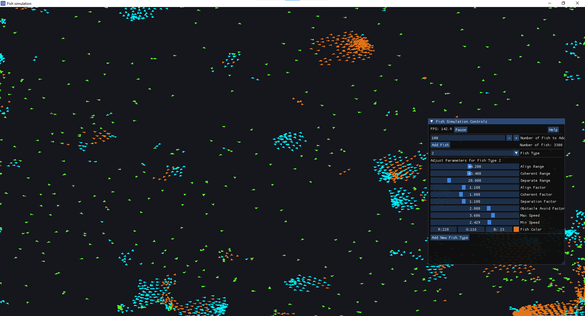
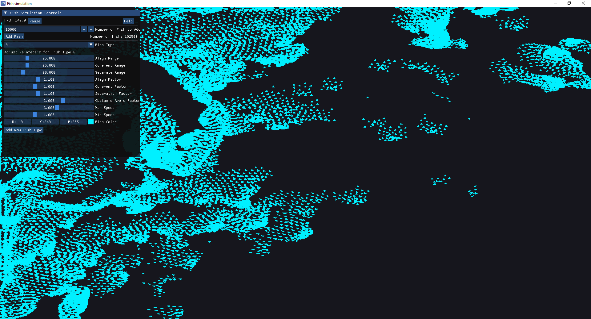
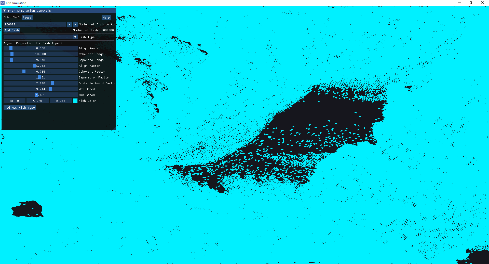

# Fish Simulation (CUDA Boids)

Fish Simulation is a **high-performance 2D boid simulation** running on the GPU using **CUDA**.  
It uses **SDL2** and **OpenGL** for visualization and can simulate **100,000+ boids** smoothly,  
scaling up to **1 million boids** in real-time, thanks to the use of a uniform grid spatial data structure.

  

## Features

### Interactive Controls
- **Left Mouse Button (LMB)**: Boids will **avoid the cursor** when pressed.
- Adjustable simulation parameters in real-time.

### Customizable Boid Behavior
- Create multiple **boid types** with unique behaviors.
- Modify individual boid parameters:
  - **Alignment**: Tendency to match velocity with nearby boids.
  - **Cohesion**: Tendency to move towards the center of nearby boids.
  - **Separation**: Tendency to avoid crowding nearby boids.
  - **Obstacle Avoidance**: Strength of boid avoidance of cursor when clicking.
  - **Speed Range**: Minimum and maximum speed.
  - **Color**: Assign different colors to different boid types.

## 100 000 boids

  

## 1 million boids

  

